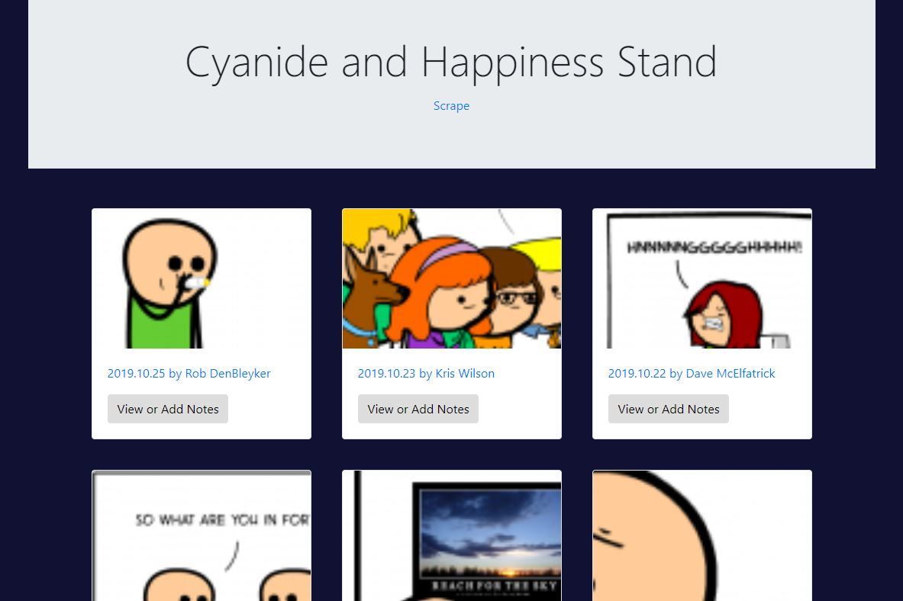

# Mongo Stand

## Summary
This is my mongo stand application that scrapes the cyanide and happiness website and displays the results. Users are able to add and delete notes to individual results. 

## Site Pictures


## Technologies Used 
- HTML - Used to create elements on the DOM
- JS - Used to manipulate content on HTML
- JQuery - JavaScript library used for DOM manipulation
- AJAX - Used to update webpage asynchronously through outside web server data exchange
- MongoDB - NoSQL database program
- Git - Version control system to track changes to source code
- Github - Hosts repository that can be deployed to GitHub pages

## Code Snippet
The following code shows the mongoose schema created for each article/result from cyanide and happiness.  
```js
var mongoose = require("mongoose");

var Schema = mongoose.Schema;

var ArticleSchema = new Schema({
  title: {
    type: String,
    required: true
  },
  link: {
    type: String,
    required: true
  },
  image: {
    type: String,
    required: true
  },
  note: {
    type: Schema.Types.ObjectId,
    ref: "Note"
  }
});

var Article = mongoose.model("Article", ArticleSchema);

module.exports = Article;
```

## Author Links
https://github.com/hagoodj